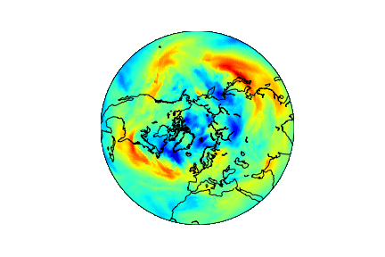

# Code for ICPR 2020 conference paper on atmospheric blocking detection (a binary classification + an localisation (regression task)) using various CNN architectures based on VGG architecture:

[Muszynski, Grzegorz, et al. "Atmospheric Blocking Pattern Recognition in Global Climate Model Simulation Data." 2020 25th International Conference on Pattern Recognition (ICPR). IEEE, 2021](https://ieeexplore.ieee.org/abstract/document/9412736)